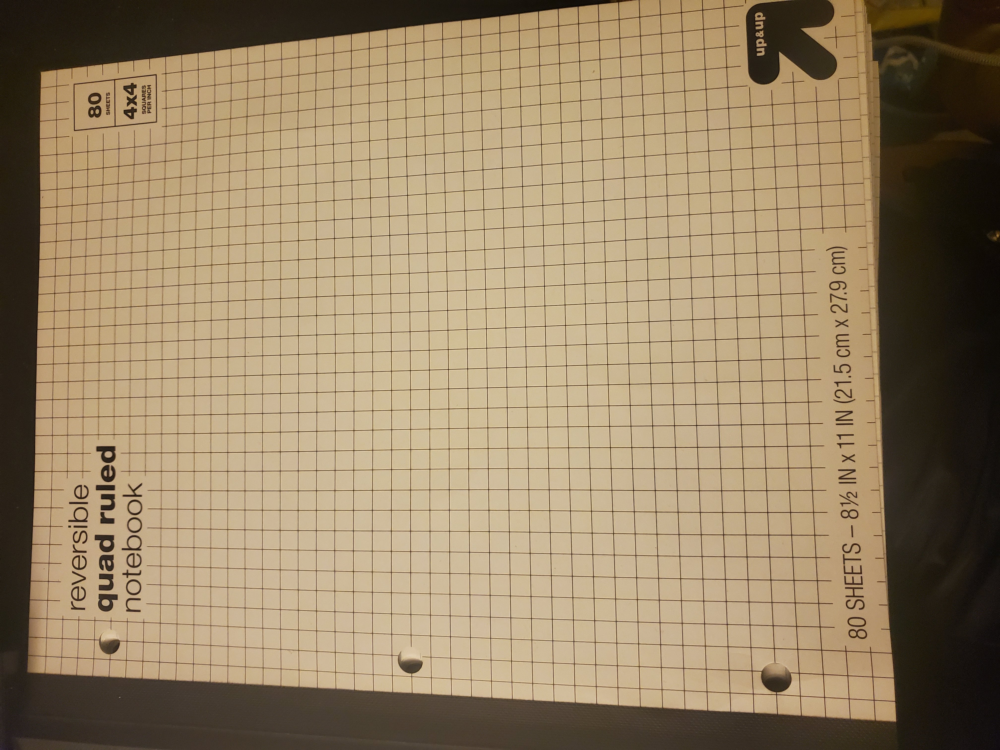

# This is a ~~very~~ super **cool** website

This is my favorite notebook to take class notes in



My mother once told me
> You really should go to college
So, here I am now


My facorite part of coding class is when I get to write

```
Hello world
```

My favorite search engine is [google](https://www.google.com/)


This is the [readme](./README.md) that took me an hour to create


My hobbies that I want to integrate with code
- Stock trading
- Music


My favorite programming languages
1. Java
2. C
3. ARM

help

I don't know if I have to include a 
 * nested
   * list


Classes I've done this week

- [x] cse 101
- [x] cse 110 message
- [ ] Math 183


